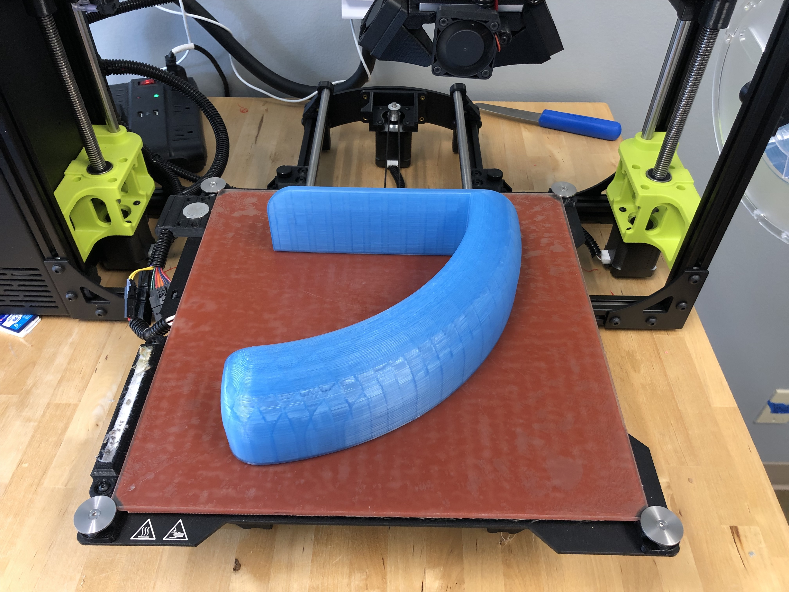

# Anti UDT Shroud

## Printing Instructions

- Orientation: Lying down
- Fill: 10-20%
- Tested on: LulzBot TAZ 6 with PolyLite PLA

Depending on the orientation of your handle, mirror the model while slicing it to print a shroud which will fit your handle.

## Usage Instructions

This defensive tool should be fitted around a lever-action door handle to prevent unauthorized access using an Under Door Tool. While this model provides no security guarantees, it does make using an Under Door Tool much more challenging.
