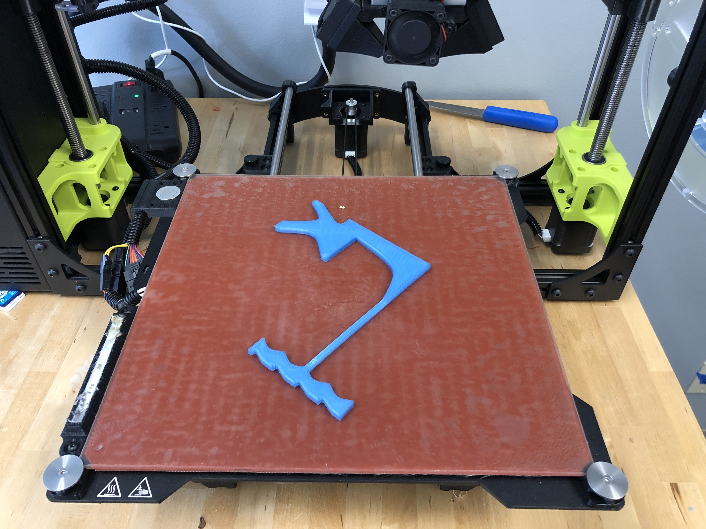

# Double Door Tool

## Printing Instructions

- Orientation: Lying down
- Fill: 80-100%
- Tested on: LulzBot TAZ 6 with PolyLite PLA

## Usage Instructions

Attach strong string to the far end of the tool. Insert the tool in the middle slit of your target door. Orient the tool to hit the crash bar on the inside. Simultaneously pull string and handle to actuate the crash bar. Open the door fully from the outside.

Disclaimer: DDTs should be made out of metal. The only reason to use this DDT is if you 1) are interested in how it works and want to try it once or 2) you have no other DDT available. The reason this DDT requires string and two hands to operate is that **it will snap if you only pull on the handle**. 