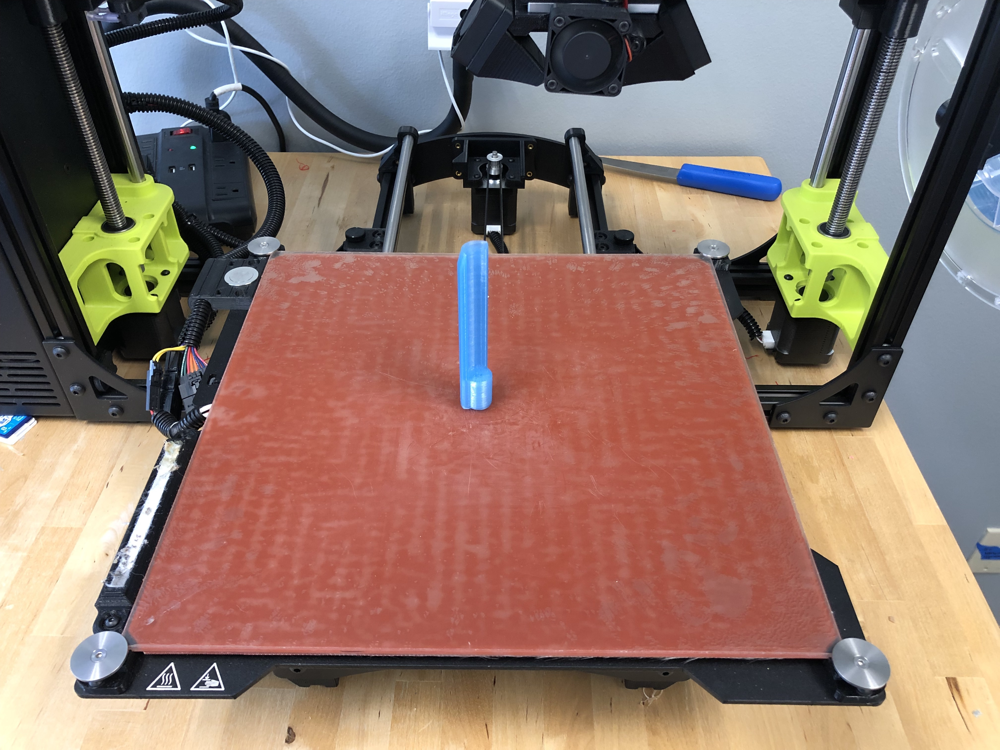

# Hinge Removal Aid

## Printing Instructions

- Orientation: Standing up
- Fill: 30-50%
- Tested on: LulzBot TAZ 6 with PolyLite PLA

Once printed, hammer in a nail into the bottom of the aid. Depending on the diameter of the nail, use super glue to secure the nail.

## Usage Instructions

Exposed door hinges can be punched to bypass the lock on the door. Use this tool as a guide for tapping the hinge out with a hammer. It reduces the risk of damaging yourself or the door during the process.